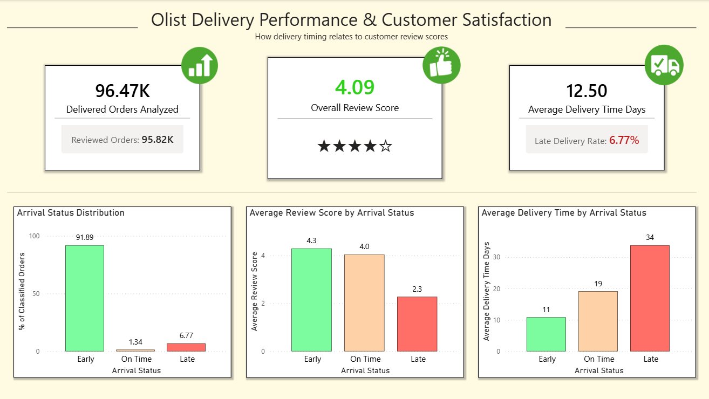
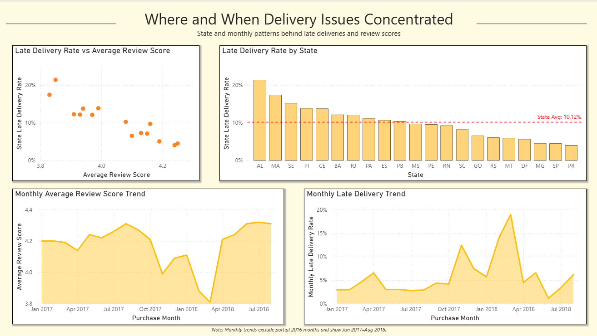

# Olist Delivery Performance & Customer Satisfaction

This project analyzes the Olist Brazilian E-Commerce dataset to understand how delivery performance relates to customer review scores. The analysis focuses on whether late deliveries are associated with lower customer satisfaction, and where or when delivery issues appear more concentrated.

## Dashboard Preview

### Page 1 — Delivery Performance & Customer Satisfaction Overview



### Page 2 — State and Monthly Delivery Patterns



Full Power BI dashboard export:

[View Dashboard PDF](dashboard/olist_customer_satisfaction_dashboard.pdf)

---

## Project Objective

The goal of this project is to answer:

**How does delivery performance relate to customer review score?**

The analysis focuses on:

- Whether late deliveries are associated with lower customer review scores
- How delivery status differs across orders
- Which states had higher late delivery rates
- Whether monthly delivery trends show recurring timing patterns

---

## Tools Used

- Python
- Pandas
- SQLite / SQL
- Power BI
- Power Query
- DAX

---

## Dataset

Dataset used:

**Brazilian E-Commerce Public Dataset by Olist**

The raw dataset is not included in this repository. It can be downloaded from Kaggle.

The analysis uses processed summary files created from the raw Olist tables.

---

## Dashboard Pages

### Page 1: Delivery Performance & Customer Satisfaction

Page 1 gives an overview of the relationship between delivery status and customer review score.

It includes:

- Delivered orders analyzed
- Overall review score
- Average delivery time
- Arrival status distribution
- Average review score by arrival status
- Average delivery time by arrival status

### Page 2: Where and When Delivery Issues Concentrated

Page 2 breaks the delivery issue down by state and month.

It includes:

- Late delivery rate by state
- Late delivery rate vs average review score by state
- Monthly average review score trend
- Monthly late delivery trend

Monthly trend charts exclude partial 2016 months and show Jan 2017–Aug 2018.

---

## Key Findings

### 1. Late deliveries had much lower review scores

**Observation:**  
Late deliveries averaged a 2.3 review score, while early deliveries averaged a 4.3 review score.

**Interpretation:**  
Late delivery status is strongly associated with lower customer satisfaction, suggesting that delivery reliability is an important part of the customer experience.

**Recommendation:**  
Investigate the main causes of late deliveries and prioritize controllable issues that could reduce late delivery rates.

---

### 2. Most deliveries arrived early

**Observation:**  
Among classified delivered orders, 91.89% arrived early, while 6.77% arrived late.

**Interpretation:**  
Delivery performance is generally strong overall, so the issue is not a broad company-wide delivery failure. The bigger opportunity is identifying where late deliveries are concentrated.

**Recommendation:**  
Maintain the current overall delivery performance while using state and monthly breakdowns to target the specific areas where late deliveries are more common.

---

### 3. Late delivery issues were geographically concentrated

**Observation:**  
States such as AL and MA had some of the highest late delivery rates and weakest average review scores, while states such as SP and PR had some of the lowest late delivery rates and strongest average review scores.

**Interpretation:**  
Late delivery problems appear to be geographically concentrated, and states with higher late delivery rates generally show lower customer review scores.

**Recommendation:**  
Investigate delivery processes in high-late-rate states and compare them with stronger-performing states to identify possible differences in logistics, fulfillment, or delivery expectations.

---

### 4. Monthly spikes appeared, but no clear month-of-year pattern

**Observation:**  
Monthly late delivery rates fluctuated over time, with a noticeable spike around early 2018. However, the same month in the prior year did not show the same spike.

**Interpretation:**  
Late delivery problems do not appear to follow a clear recurring month-of-year pattern in this dataset. The issue looks more like a specific operational spike than a predictable seasonal pattern.

**Recommendation:**  
Monitor monthly delivery performance for future spikes, but prioritize the clearer state-level delivery issues unless more evidence of recurring seasonality appears.

---

## Data Preparation Summary

The raw Olist CSV files were loaded into SQLite using Python. SQL was then used to create an order-level dataset with one row per order.

The main analysis table was:

- `order_level_summary`

This table combined:

- order information
- customer location
- delivery dates
- review scores
- item counts
- product category context
- delivery timing metrics

Key calculated fields included:

- `delivery_time_days`
- `delivery_delay_days`
- `arrival_status`

Arrival status was defined as:

- **Early**: delivered before the estimated delivery date
- **On Time**: delivered on the estimated delivery date
- **Late**: delivered after the estimated delivery date

Orders without measurable delivery status were excluded from delivery-performance metrics.

---

## Processed Data Files

The main processed files used in the dashboard are:

```text
data/processed/order_level_summary.csv
data/processed/arrival_status_summary.csv
data/processed/review_score_by_arrival_status.csv
data/processed/state_delivery_review_summary.csv
data/processed/monthly_delivery_review_summary.csv
```

---

## SQL Files

The SQL folder contains:

```text
sql/01_create_order_level_summary.sql
sql/02_create_dashboard_summary_tables.sql
```

`01_create_order_level_summary.sql` creates the main one-row-per-order analysis table.

`02_create_dashboard_summary_tables.sql` creates the dashboard summary tables used in Power BI.

---

## Repository Structure

```text
olist-delivery-customer-satisfaction/
│
├── README.md
│
├── data/
│   ├── raw/
│   │   └── README.md
│   │
│   └── processed/
│       ├── order_level_summary.csv
│       ├── arrival_status_summary.csv
│       ├── review_score_by_arrival_status.csv
│       ├── state_delivery_review_summary.csv
│       └── monthly_delivery_review_summary.csv
│
├── dashboard/
│   ├── olist_delivery_dashboard.pbix
│   ├── olist_customer_satisfaction_dashboard.pdf
│   │
│   └── images/
│       ├── page_1_delivery_review_overview.png
│       └── page_2_state_monthly_breakdown.png
│
└── sql/
    ├── 01_create_order_level_summary.sql
    └── 02_create_dashboard_summary_tables.sql
```

---

## Main Takeaway

Late deliveries were associated with much lower customer review scores. However, most delivered orders arrived early, meaning the issue was not a broad delivery failure across the entire dataset. The strongest opportunities appear to be identifying high-risk states and monitoring future monthly spikes in late delivery performance.
